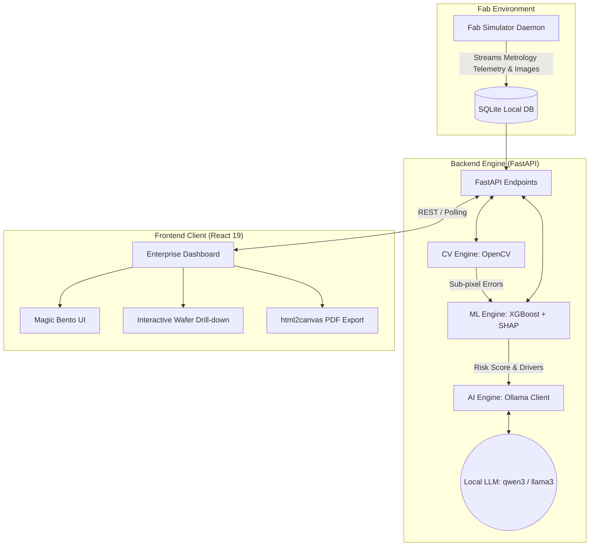
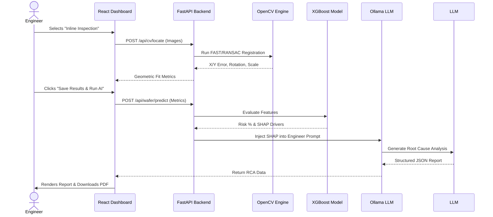

# 🔬 SemSight (formerly Drift-Sense)

> **AI-Powered Semiconductor Yield Analytics & Nanoscale Navigation-Error Recovery**

SemSight is an enterprise-grade platform designed to solve one of the most expensive problems in semiconductor manufacturing: **navigation drift and yield loss during automated metrology inspection.** By seamlessly bridging scale-aware Computer Vision, XGBoost Risk Classification, and Generative AI, SemSight allows engineers to recover precise inspection coordinates, predict structural failures in real-time, and automatically generate Root Cause Analysis (RCA) reports.

---

## 🌟 Unique Selling Proposition (USP)

Current fab workflows rely on disconnected metrology tools and manual engineering reviews that take hours. **SemSight reduces time-to-insight from hours to seconds.** 
Our USP lies in the **trifecta pipeline**: 
1. **Geometric Recovery**: Sub-pixel image registration across massive scale differences (10x+ scale gaps).
2. **Predictive Intelligence**: Real-time evaluation of physical defect drivers using SHAP values.
3. **Agentic Copilot**: Local LLaMA/Qwen models instantly translating statistical anomalies into actionable engineering instructions (e.g., "Review Lithography stage overlay errors").

---

## 🚀 Novelty & Innovations

*   **Scale-Aware Dual-Pass Registration:** Traditional feature matching fails when the reference image (1 nm/px) and the search image (10 nm/px) differ drastically. SemSight uses a custom FAST/RANSAC pipeline with a dynamic `robust_threshold` to achieve geometric fit even in highly periodic, noisy layouts (DRAM/FinFETs).
*   **SHAP-to-Text Generative AI Pipeline:** Instead of throwing raw machine learning arrays at engineers, SemSight feeds XGBoost SHAP (SHapley Additive exPlanations) values directly into a locally hosted Ollama instance. The AI acts as a Senior Process Engineer, generating contextual PDFs with recommended equipment calibrations.
*   **Non-Blocking Fab Simulator Daemon:** The backend features a background simulator that constantly generates synthetic telemetry, mimicking a live 24/7 semiconductor fab environment to stress-test the UI.

---

## 🏗️ System Architecture

SemSight is built on a decoupled, highly scalable architecture utilizing React, FastAPI, OpenCV, and local LLM inference.



### 🧩 Core Components

1.  **Frontend (React 19 + Vite + Tailwind):** 
    *   Enterprise dark-mode aesthetic with GSAP-powered animations.
    *   **Inline Inspection Module:** Live OpenCV integration allowing engineers to visually calculate X/Y displacements and overlay errors.
    *   **Wafer Drawer:** A detailed drill-down showing process timelines, SHAP risk drivers, and 1-click AI RCA generation.
2.  **CV Engine (OpenCV Python):**
    *   Handles geometric transformations, rotation offsets, and scale calculations between golden reference die and actual drifted stage captures.
3.  **ML Engine (XGBoost + scikit-learn):**
    *   Pre-trained model (`xgboost_wafer_risk.json`) evaluating translation limits and feature confidence to flag wafers as `NORMAL`, `DRIFT`, or `CRITICAL`.
4.  **AI Engine (Ollama):**
    *   A strictly prompted LLM agent (`prompts.py`) that strictly outputs structured root causes, impact assessments, and investigation points based purely on provided telemetry.

---

## ⚙️ Data Flow & User Journey



---

## 🛠️ Technology Stack

| Category | Technology |
| :--- | :--- |
| **Frontend** | React 19, TypeScript, Vite, Tailwind CSS, Recharts, GSAP, Lucide React, jsPDF |
| **Backend** | Python 3.10+, FastAPI, Uvicorn, Pydantic |
| **Computer Vision** | OpenCV (`cv2`), NumPy |
| **Machine Learning** | XGBoost, SHAP, scikit-learn, joblib |
| **Generative AI** | Ollama (Local inference, `qwen3:8b` / `llama3`) |
| **Database & DevOps** | SQLite, Docker, Docker Compose |

---

## 🚦 Getting Started

### Prerequisites
*   Node.js (v18+)
*   Python (3.10+)
*   [Ollama](https://ollama.com/) (running locally with `qwen3:8b` or similar model)
*   *Optional:* Docker Desktop

### Installation

1. **Clone the repository:**
   ```bash
   git clone https://github.com/aryxan/Semicon_Hackathon.git
   cd Semicon_Hackathon
   ```

2. **Frontend Setup:**
   ```bash
   npm install
   npm run dev
   ```

3. **Backend Setup:**
   
   **Option A: Docker Compose (Recommended)**
   ```bash
   docker-compose up --build -d
   ```
   
   **Option B: Standard Python**
   ```bash
   python -m venv backend/venv
   # Windows: backend\venv\Scripts\activate
   # Mac/Linux: source backend/venv/bin/activate
   pip install -r backend/requirements.txt
   python backend/main.py
   ```

4. **Start the Fab Simulator (in a new terminal):**
   ```bash
   python simulate_lab.py
   ```

5. **Access the Application:**
   Open your browser and navigate to `http://localhost:5173`. 
   *(Default Demo Login: admin / admin)*

---
*Built for the Semicon Hackathon.*
